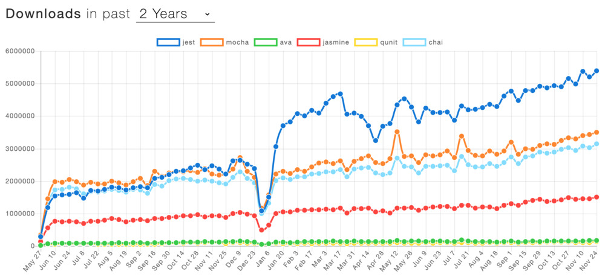

Learn Advanced JavaScript Testing patterns with Jest.

Get testing superpowers by leveraging underused Jest features.

<button class="cp-button" data-seller="hugo" data-checkout="jest-handbook">Get the 30% Launch Discount now</button>

## Who is this for?

You're a JavaScript developer who wants to learn unit testing?

You come from a non-JS background and want to apply your existing unit testing knowledge in JavaScript?

You're proficient at testing in JavaScript and would like to learn Jest best-practices and featureset?

The Jest Handbook is for you.

## Learning outcomes

1. Gain a deep understanding of the options available to the Jest CLI and how to use different views to write and debug tests more effectively. 
2. Leverage spying, stubbing and module import interception functionality in tests and create mock JavaScript object instances, stub ES6 classes and mock out global objects.
3. Use and contrast 2 approaches to testing backend applications with Jest as well as illustrate synchronous and asynchronous testing patterns.
4. Employ advanced Jest partial matchers to write tests with high specificity and reduce toil when updating application code.
5. Leverage Jest's built-in coverage tool to set minimum coverage thresholds, find parts of the code that aren't tested and how to disable it in specific cases.

## Table of Contents

1. Jest/Jest CLI expert - Debugging tests
   - run jest tests sequentially why/how
   - run single file/folder
   - run single test
   - interactive watch mode (filtering by file name, failing tests, test filename regex)
   - running in CI mode

2. Spying, stubbing - become a stub/mock function assertion pro
   - mock assertion reference
   - set, clear, reset mocks and spies
   - example: mocking the current date (how to mock a global object/class) -> 4 examples
   - stub ES6 class "extends"
   - master Object.defineProperty to create mock JavaScript application object instances
   - Mocking of CommonJS and ES6 imports

5. Testing synchronous vs asynchronous code
   - `test('a', async () => { await codeUnderTest() })`
   - Testing for asynchronous throws (`return expect().rejects`)
   - mocking output of synchronous and asynchronous functions
   - failing a test programmatically `fail()`, `throw 'foo'`

6. Partial matches
   - objectContaining
   - arrayContaining
   - nested arrayContaining, objectContaining
   - assert over only some of the parameters `expect.anything()`
   - `expect.any(Function)` etc.

5. Philosophies to write unit tests for Express.js
   - mock request/response objects in-memory
   - leverage supertest

6. Coverage in Jest
   - coverage thresholds
   - using Jest coverage reports to find code that's not being exercised
   - exclude a line, file or statement from coverage reports

> Interested in upgrading your Jest and testing game?

<button class="cp-button" data-seller="hugo" data-checkout="jest-handbook">Get the 30% Launch Discount now</button>

## Why Jest? A note from the author

Jest is the most widespread solution to test JavaScript applications. Jest is a modern, batteries-included testing framework that comes with all features you need to set up for your JavaScript tests including coverage, interactive watch mode, advanced matchers.

Jest is the leading test framework in terms of downloads as of 2020 as per [npmtrends Jest vs Mocha vs AVA     vs Jasmine vs QUnit vs Chai](https://www.npmtrends.com/jest-vs-mocha-vs-ava-vs-jasmine-vs-qunit-vs-chai). Jest came out of efforts from Facebook. It's is used at a plethora of small and large companies including Facebook, AirBnB, The New York Times and Spotify.
 

I've looked around the web for resources dedicated to teaching you the ins and outs of Jest. The vast majority of solutions are GitHub issues or StackOverflow posts, and there are a few React/Vue.js (framework specific) testing books out there. None really focus on Jest itself and how it can be leveraged to write better tests, faster.

The Jest Handbook is an example and solutions-driven book that will teach you in the ins and outs of testing JavaScript applications with Jest.

## About the Author

Hugo Di Francesco is a co-author of "Professional JavaScript" with Packt. He runs the Code with Hugo website helping over 100,000 developers every month and holds an MEng in Mathematical Computation from University College London (UCL). He has used JavaScript extensively to create scalable and performant platforms at companies such as Canon and Elsevier.

Hugo has also written some of the top articles on the internet about Jest at [codewithhugo.com/tags/jest/](https://codewithhugo.com/tags/jest/) including:

- [A testing guide for Express with request and response mocking/stubbing using Jest](https://codewithhugo.com/express-request-response-mocking/)
- [How to run, ignore or skip Jest tests, suites and files](https://codewithhugo.com/run-skip-single-jest-test/)
- [Jest Full and Partial Mock/Spy of CommonJS and ES6 Module Imports](https://codewithhugo.com/jest-mock-spy-module-import/)
- [Mocking/stubbing the current Date in Jest tests](https://codewithhugo.com/mocking-the-current-date-in-jest-tests/)
- [Jest .fn() and .spyOn() spy/stub/mock assertion reference](https://codewithhugo.com/jest-fn-spyon-stub-mock/)
- [Jest ignore or exclude file/function/statement from test coverage](https://codewithhugo.com/jest-exclude-coverage/)

<button class="cp-button" data-seller="hugo" data-checkout="jest-handbook">Get the 30% Launch Discount now</button>

<noscript></noscript>
